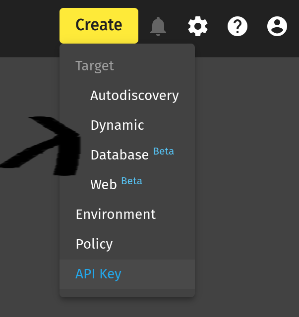
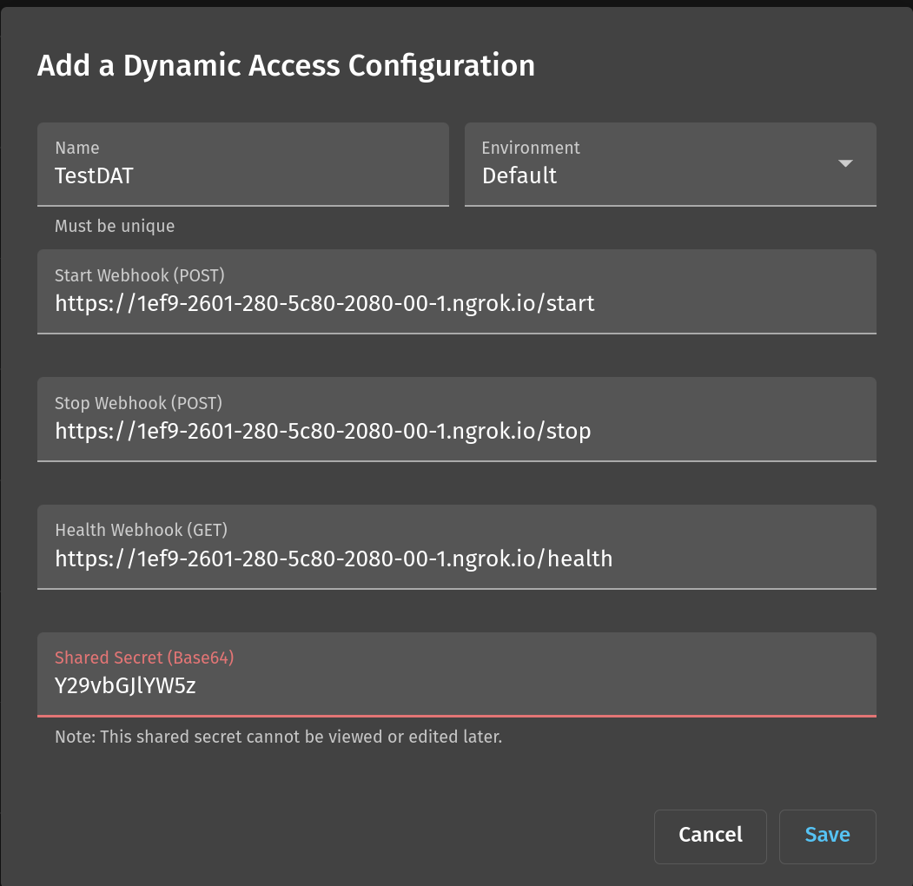
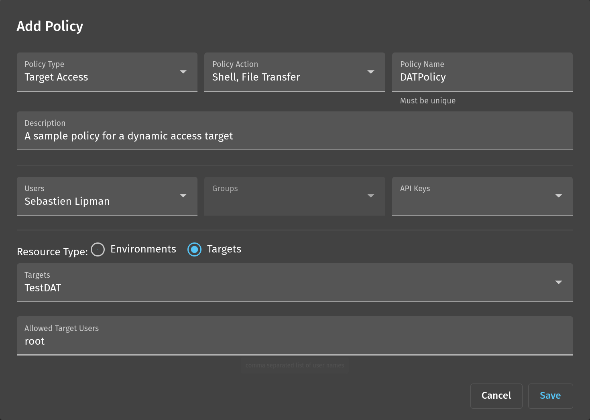

# dynamic-access-example

Bastionzero is a simple to use zero trust access SaaS for dynamic cloud
environments. Bastionzero is the most secure way to lock down remote access to
servers, containers, clusters, and VM’s in any cloud, public or private. For
more information go to [Bastionzero](https://bastionzero.com).

## Dynamic Access Target

Bastionzero targets are resources that a user can log into, such as a server,
container, or virtual machine. Dynamic Access Targets are ephemeral targets that
are spun up and torn down on-demand for a particular user. When a user wants to
connect to a Dynamic Access Target, BastionZero will send a start webhook to
your provisioning server to signal that a new target should be created and
registered. Once the user closes all of their connections to a particular
Dynamic Access Target then BastionZero will send the stop webhook to the
provisioning server to signal that the target should be deleted.

This code repository provides a reference implementation of the web hook server
and API for integrating with Bastionzero Dynamic Access Targets. The example
server here works by using docker containers as the ephemeral targets.

## API Specification

### Authentication

All requests contain an `Authorization` header that will include the base64 string provided to
Bastionzero in the Add Dynamic Access Config UI. Bastionzero will include the same base64 string
in all requests made to the provisioning server using the Basic scheme.

```
Authentication: 'Basic <Base64String>'
```

### POST Start

The start endpoint is responsible for spinning up a target with the Bastionzero
agent on it. It should do this by passing the `activationToken` it receives in the start webhook to the `bzero-beta` agent when starting it up. An example of how to start the agent with the `activationToken` can be seen in
[`entrypoint.sh`](DynamicAccessContainer/EntryScript/entrypoint.sh).

```json
// Request
{
    "serviceUrl": "string",
    "activationToken": "string",
    "environmentId": "string"
}

// Response
{
    "uniqueId": "string"
}
```

#### Request Parameters

`serviceUrl`: Should be passed to the agent when registering the target.
This is the url the agent uses to register the target with BastionZero.

`activationToken`: Should be passed to the agent when registering the
target.

`environmentId`: Can be optionally passed to the agent when
registering the target. The environmentId value passed in the start webhook is
the default environment configured for this Dynamic Access Target in the
BastionZero WebApp.

#### Response Parameters

`uniqueId`: A unique Id the provisioning server should generate per target. It
will be returned again to the provisioning server when Bastionzero send the Stop
webhook. Use this uniqueId to determine the specific target to delete once its
no longer has any user connections. In this example server we use the docker
container ID as the `uniqueId` so that in the stop webhook we can simply kill
the container.

### POST Stop

The stop endpoint is responsible for tearing down the target given the
`uniqueId` provided in the start webhook.

#### Request Parameters

`uniqueId`: Same ID that was returned by the provisioning server in the start webhook

```json
// Request
{
    "uniqueId": "string"
}

// Response
// 200 HTTP OK
{ }
```

### GET Health

The health endpoint acts as a liveliness indicator for target status updates in
the BastionZero WebApp and Zli.

```json
// Request
// Empty query string

// Response
// 200 HTTP OK
{}
```

## Running the dynamic-access-example server

### Prerequisites
- Python
- Docker (daemon running locally on your machine)
- [ngrok](https://github.com/inconshreveable/ngrok)
- A BastionZero Account
- BastionZero [zli](https://docs.bastionzero.com/product-docs/zli/zli-reference-manual#overview)

### Step 1: Building the docker image

```bash
docker build -t bzero/dynamic-access-example ./DynamicAccessContainer/
```

If you use a custom docker image name make sure to update the dockerImageName
constant in
[`dynamic-access-server.py`](DynamicAccessServer/dynamic-access-server.py)
module

### Step 2: Run the provisioning server

We recommend setting up a python virtual environment to install dependencies
rather than installing them globally for your user.

```bash
homebrew install pyenv virtualenv
virtualenv dynamic-access-virtualenv
source dynamic-access-virtualenv/bin/activate
```

Then to leave the virtual environment the following is a special command that
the virtualenv will detect and detach itself from your console.

```bash
deactivate
```

#### Install the python requirements

```bash
pip3 install -r reqs.txt
```

#### Run the server

Note by default the server will run on port 6001. If you want to change this
just edit this in the
[`dynamic-access-server.py`](DynamicAccessServer/dynamic-access-server.py#149)
and take note of the port you are using when configuring the Dynamic Access
Target in BastionZero.

```bash
python3 DynamicAccessServer/dynamic-access-server.py
```

#### Check your sever is running and is healthy (docker daemon is running)

```bash
curl -XGET http://127.0.0.1:6001/health -v
```

#### Use ngrok to create a reverse tunnel to your provisioning server

If you dont have ngrok you can install it through node/npm globally with:

```bash
npm i -g ngrok
```

Use ngrok to start a reverse tunnel to your provisioning server running on
localhost:6001 and expose it through a public endpoint

```bash
ngrok 6001
```

Take note of the https endpoint that is created by ngrok (e.g)

```
Forwarding                    https://c032-2601-280-5c80-2080-00-1.ngrok.io -> http://localhost:6001
```

### Step 3: Register the provisioning server in the BastionZero WebApp

#### Create a new Dynamic Access Target Configuration

1. Log into the [BastionZero WebApp](https://cloud.bastionzero.com)

2. An organization administrator has the ability to add a _Dynamic_ target configuration in the _Create_ dropdown menu found in the top-right corner of the BastionZero web app.



3. Configure the Dynamic Access Target to use this example provisioning server

- Use the https url generated by ngrok followed by `/start` , `/stop`,
  `/health` for the start, stop, and health endpoints respectively

- Copy the shared authentication secret that will be used by the provisioning
  server to authenticate requests from BastionZero. In this example we have
  hard-coded the shared secret to be: `Y29vbGJlYW5z` but do not use this
  value in a production environment. See [Authentication](#authentication).



#### Setup a policy to be able to access this Dynamic Access Target

Create a new _Target Access_ policy in order to be able to get a shell to this Dynamic Access Target through the zli. You can make either select _Environments_ as the resource type of the policy and use the same environment you setup above or choose _Targets_ as the resource type and select the . In this example we use `root` as the targetUser because that is the only login user that exists on the container by default.



#### Step 4: Create a connection to the Dynamic Access Target using the zli

```shell
zli connect root@TestDAT
```

When connecting to a Dynamic Access Target if no target exists yet for the user who is connecting then BastionZero will send a request to the provisioning server to spin up and register a new target. Then the zli will poll for updates and wait for the target to come online before connecting.

```
Waiting on the dynamic access target to register and come online...
Waiting on the dynamic access target to register and come online...
Dynamic access target is online!
bash-4.2#
```

Note if you try and create another connection to the same Dynamic Access Target while there is already an open connection to the same target then BastionZero will reuse that target. Finally, once all user connections to the target are closed then BastionZero will send the stop webhook to the provisioning server to request the target be terminated.